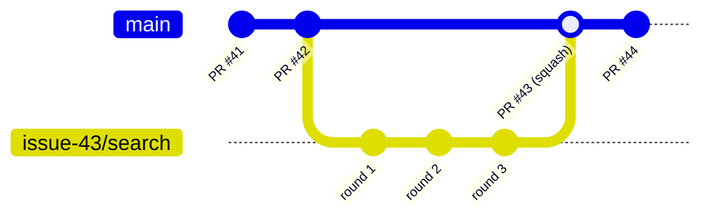
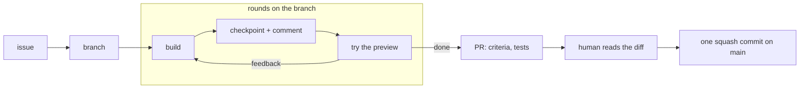

# GNADD

[](https://github.com/AlexHagemeister/gnadd/releases)
[](LICENSE)
[](https://ko-fi.com/V1N723QW1K)

Git-Native Agent-Driven Development. A way to build software with a coding agent where GitHub is the only place project state lives. Issues say what to build. Branches are where work happens. Pull requests record what shipped. There are no task files, no progress notes, and no plan documents for the agent to keep current.

GNADD ships as a set of [Agent Skills](https://agentskills.io): instruction files an agent loads when you invoke them. The skills carry the conversation. A tested shell script bundled inside them carries every git operation, so the agent never improvises a `reset` or a `force` push. GitHub's own rules (squash-only merges, a protected `main`) hold the rest.

It works with any agent the [skills CLI](https://github.com/vercel-labs/skills) supports, including Cursor, Claude Code, and Codex.

**Full guide:** [GNADD.md](GNADD.md). This README is the front door. The guide holds the model, the rules, and the reasoning behind each decision.

**In a hurry?** The [Quickstart](#quickstart) is lower on the page, with a prompt to hand your agent and the install commands for each route.

Issues and pull requests from outside are welcome. [CONTRIBUTING.md](CONTRIBUTING.md) has the terms.

If GNADD saves you a bad `git reset` or two, a star on the repo is the cheapest way to say so, and it helps the next person find it.

<p align="center">
  <a href="https://ko-fi.com/V1N723QW1K">
    
  </a>
</p>

## The problems it removes

Working with a coding agent tends to produce three kinds of mess. GNADD is built around not creating them.

1. **Task files that rot.** A `tasks.md` with checkboxes, a progress note, a "current status" section. Each one is state the agent has to keep updated. Each one drifts from reality the moment someone forgets. Stale state then feeds the agent wrong context. In GNADD the task list is the GitHub issue list. "In progress" means a branch exists. "Done" means a PR merged. Nothing has to be maintained because the state is a side effect of doing the work.

2. **Plans that break on contact.** A spec or implementation plan written before the code bakes in choices that only make sense once the real codebase exists. When a library turns out not to fit, the agent builds workarounds to protect the plan instead of dropping the library. GNADD replaces the plan with `VISION.md`: what is true no matter what gets built, and what could be, marked by how committed you are. The how gets decided issue by issue, against the real code.

3. **Improvised git.** An agent that runs raw git commands will eventually reset the wrong branch or force-push over a commit. In GNADD every git sequence runs through one script that halts and asks whenever a decision could lose work. The sanctioned way out of a bad state is a diagnosis command, never a clever fix.

The one thing no layer can catch: merging without reading the diff. That part stays yours.

## Where it sits among git workflows

GNADD is [GitHub Flow](https://docs.github.com/en/get-started/using-github/github-flow), compacted and packaged as agent skills. GitHub's own description of the flow is six steps: create a branch, make changes, open a pull request, address review, merge, delete the branch. That is the GNADD loop. One `main` that is always releasable, one short-lived branch per change, and a pull request as the only way back in.



One branch per issue, checkpoints as rounds, and one squash commit back on `main`. The branch is deleted at merge. The merge edge above stands for that squash: `main` itself stays linear.

GitHub Flow leaves most choices open. GNADD closes them, and the closed choices are what distinguish it:

- **The issue comes first and is the spec.** A branch exists only because an issue does. One issue, one branch, one PR.
- **Squash-only merges.** Each merged PR is one commit on `main`, with the PR body as its message. Reverting a feature is reverting one commit.
- **No local rebase, and never a reset on `main`.** Syncs are fast-forward only. Anything else halts and asks.
- **Merged branches are deleted**, by GitHub, at merge.
- **GitHub is the only record.** No task file, no progress note, no maintained plan.
- **Deploy is outside the model.** GNADD ends at the merge. What happens to `main` after that is the project's business.

Two other common models, for contrast:

| Model | Long-lived branches | How change lands | Where GNADD differs |
|---|---|---|---|
| [Git Flow](https://nvie.com/posts/a-successful-git-branching-model/) (Driessen, 2010) | `master` and `develop`, plus release and hotfix branches | Merge commits with `--no-ff`, so every branch's history stays in the graph | One branch, no release or hotfix branches, and the history of a feature lives in the PR rather than in the graph |
| [Trunk-based development](https://trunkbaseddevelopment.com/) | One trunk | Commits straight to trunk, or branches that live a day or less, with feature flags for longer work | Same short-lived branches, but every change passes through a PR that a human reads before it lands |

## What a session looks like

**Starting a project.** Create the repo on GitHub, then run `/init-gnadd`. It turns on the server-side rules and writes a small conventions file (`AGENTS.md`) that tells any agent the repo runs GNADD and how to launch a preview of the app. Then run `/vision-gnadd`: talk through the idea and the agent writes `VISION.md` in your words, confirmed by you. It then offers to open the first phase, a GitHub milestone whose description says what this stretch of work is trying to find out and what ends it. Capture the first three or four issues with `/new-issue-gnadd`, and stop there. Issues are cheap to add later.

**Every session after that.** Start with `/prime-gnadd`. It fetches from GitHub and reports where things stand: the branch you are on, the open phase, open issues, PRs in flight, what shipped recently, and any warning that needs sorting before new work. Then:

1. `/start-issue-gnadd <N>` branches off `main`, loads the issue as the working spec, and proposes a plan. You say go.
2. The work runs in rounds. The agent builds a slice, checkpoints it with `/commit-gnadd`, and hands you a running preview to try. You try it and say what you think. That drives the next slice. Each checkpoint posts a comment on the issue with what changed and your feedback, so a branch that spans sessions picks up where it left off.
3. When the work is done, `/resolve-issue-gnadd` checks the diff against the issue's acceptance criteria, runs the project's tests, opens the PR, and gives you the link.
4. You read the diff. Then you say merge. The PR body becomes the commit on `main`, the branch is deleted, and the issue closes.



Two shortcuts sit beside the loop. `/quickfix-gnadd` lands one trivial change (a typo, a one-line doc fix) through a PR with no issue. `/yolo-gnadd` runs one already-decided issue through the whole loop without stopping at the mid-loop gates, with an independent review pass in place of your diff read. You invoke it on purpose or not at all.

**When a skill stops with a warning, that is the system working.** Read what it says and pick from the options it offers. The guide's Part 3 covers the few states you can land in and the one safe path out of each.

## The skills

| Skill | Invocation | Does |
|---|---|---|
| `help-gnadd` | `/help-gnadd`, or automatically when a question is workflow-shaped | Orients the agent on the GNADD model, the file rule, and which skill handles what |
| `audit-gnadd` | `/audit-gnadd` | Read-only review of an existing repo's context files and workflow habits, with proposed fixes to capture as issues |
| `init-gnadd` | `/init-gnadd` | Once per repo: turns on the server-side rails and writes the conventions file with the preview launch line. Safe to rerun |
| `vision-gnadd` | `/vision-gnadd` | Writes or revises `VISION.md` through an interview, in your words |
| `prime-gnadd` | `/prime-gnadd` | Start of every session: fetches from GitHub and reports project shape, branch state, phase, open issues, PRs, and warnings |
| `new-issue-gnadd` | `/new-issue-gnadd` | Interviews you into a behavioral issue with acceptance criteria, attached to the open phase |
| `start-issue-gnadd` | `/start-issue-gnadd <N>` | Branches off `main`, loads the spec, proposes a plan, then runs the build, try, feedback rounds |
| `commit-gnadd` | `/commit-gnadd`, or "commit this" | Stages and commits a checkpoint, and posts the round comment on the issue |
| `resolve-issue-gnadd` | `/resolve-issue-gnadd` | Verifies the work against the criteria, runs tests, opens the PR, waits for your merge decision, cleans up |
| `quickfix-gnadd` | `/quickfix-gnadd` | One trivial change through a CI-gated PR, no issue. Refuses large or mechanics-touching diffs |
| `yolo-gnadd` | `/yolo-gnadd <N or description>` | Runs one decided issue or quickfix through the full loop autonomously, with a review pass and a trace-backed report |

## Quickstart

Requires the [GitHub CLI](https://cli.github.com/) (`gh`) logged in and an agent with shell access. There are three ways to install, and they ship the same skill files. Pick one.

1. **Skills CLI**: any agent the [skills CLI](https://github.com/vercel-labs/skills) supports (Cursor, Claude Code, Codex, and more). Needs [Node.js](https://nodejs.org/) for `npx`.
2. **Claude Code plugin**: Claude Code only, through its plugin manager. Skills come namespaced (`/gnadd:prime-gnadd`).
3. **Fork and customize**: your own copy of GNADD on GitHub, adjusted to taste, installed by either of the two routes above with your username in place of mine.

### For humans

Paste this to your agent and answer its one question:

```text
Install GNADD for me. Fetch https://raw.githubusercontent.com/AlexHagemeister/gnadd/main/README.md, find the section "For agents", and follow it. Ask me which install route I want before running anything.
```

To do it by hand instead, run the commands under the route you want below, then read [Per-project setup](#per-project-setup).

### For agents

1. Confirm `gh auth status` shows a logged-in account. If not, stop and ask the user to run `gh auth login`.
2. Ask the user one question: which install route, skills CLI, Claude Code plugin, or fork and customize. Do not pick for them. For the skills CLI route, also ask which agent they use if you cannot tell from the environment. For the fork route, ask for their GitHub username.
3. Run the install commands under that route below, exactly as written, with the user's substitutions.
4. Confirm the install by listing the installed skills (the skills CLI prints them, the plugin manager shows them under `/plugin`) and tell the user to start their next session with `/prime-gnadd` (or `/gnadd:prime-gnadd` for the plugin route).
5. If the current directory is a git repo with a GitHub remote, offer `/init-gnadd` (see [Per-project setup](#per-project-setup)). Do not run it unasked.

### Route 1: Skills CLI (any agent)

**Global install (recommended)**, so the skills are available in every repo:

```bash
npx skills add AlexHagemeister/gnadd -g -a <agent> --copy -y
```

Replace `<agent>` with your agent (`cursor`, `claude-code`, `codex`, and so on). See the [supported agents list](https://github.com/vercel-labs/skills#supported-agents).

Omit `-g` to install into one project only. The skills then live in `.agents/skills/` and travel with that repo.

**Update after a new release:**

```bash
npx skills update -g -y    # global
npx skills update -p -y    # project
```

Use the same scope (`-g` or project) you used at install. Updating the other scope leaves the active copies stale without warning. `skills update` only tracks installs that came from GitHub. If you installed from a local checkout with `scripts/sync.sh`, rerun that instead. Flags and interactive options are in the [skills CLI docs](https://github.com/vercel-labs/skills).

### Route 2: Claude Code plugin

The repo is also a Claude Code plugin with its own one-entry marketplace. Add the marketplace, then install:

```bash
claude plugin marketplace add AlexHagemeister/gnadd
claude plugin install gnadd@gnadd
```

The same two steps work inside a session as `/plugin marketplace add AlexHagemeister/gnadd` and `/plugin install gnadd@gnadd`. Plugin skills are namespaced by plugin name, so you invoke `/gnadd:prime-gnadd`, `/gnadd:start-issue-gnadd`, and so on. Everything else is identical.

**Update after a new release:**

```bash
claude plugin marketplace update gnadd
claude plugin update gnadd@gnadd
```

The plugin manifests carry no version number on purpose: the plugin's version is the commit it was installed from, so an update pulls whatever is on `main`, the same as the skills CLI. `gnadd version` still reports the release baseline. Installing through both channels is harmless (you get `/prime-gnadd` and `/gnadd:prime-gnadd`, same skill), but one is enough.

### Route 3: Fork and customize

Fork the repo on GitHub (the **Fork** button, or `gh repo fork AlexHagemeister/gnadd`), edit the skills and the guide in your fork however you like, and install from it. Both routes above work unchanged with your username in place of `AlexHagemeister`:

```bash
npx skills add <you>/gnadd -g -a <agent> --copy -y
```

```bash
claude plugin marketplace add <you>/gnadd
claude plugin install gnadd@gnadd
```

The update commands are the same as the route you used. To work on your fork locally and install straight from the checkout, run `./scripts/sync.sh` (see [Authoring](#authoring-repo-maintainers)). Skill behavior lives in `skills/<name>/SKILL.md`, git mechanics in `bin/gnadd`. The [Repo layout](#repo-layout) table says what each file is for.

If you make a change you think belongs upstream, [CONTRIBUTING.md](CONTRIBUTING.md) says how to send it back.

### Versions and the distribution channel

**Versioning.** Releases follow [semver](https://semver.org/) and are listed on the [releases page](https://github.com/AlexHagemeister/gnadd/releases) with a [changelog](CHANGELOG.md). Before 1.0, a minor version may rename a skill or change its behavior, so read the release notes before updating. To be told about releases: **Watch, then Custom, then Releases** on the repo.

**Distribution channel.** `main` is the channel for every route. The skills CLI installs from the default branch and cannot pin a tag, and the plugin marketplace entry points at `main` on purpose, so every install and update pulls the latest `main`. The workflow keeps `main` always releasable: nothing lands without a PR, green CI, and a human reading the diff. Tags mark the tested snapshots and document what changed between updates. For that reason `gnadd version` reports a release baseline: the installed copy is that release plus whatever merged since, and it says so.

## Per-project setup

Once per repo, run `/init-gnadd`. To apply the rails alone, without the skill:

```bash
bash <path-to-installed-prime-skill>/gnadd.sh init        # add --ci for a test workflow stub
```

The rails make GitHub itself enforce the core rules: squash-only merges with the PR body as the commit message, auto-deleted merged branches, and a ruleset on `main` that requires a PR and blocks force pushes. See GNADD.md Part 4, "The enforcement layers".

## Repo layout

| Path | Role |
|---|---|
| `bin/gnadd` | The mechanics script. Single source of truth for every git sequence |
| `skills/<name>/SKILL.md` | The skills: judgment and conversation around the script |
| `skills/<name>/gnadd.sh` | Generated copies of `bin/gnadd`. Never edit these |
| `scripts/build.sh` | Copies `bin/gnadd` into the operational skills |
| `test/run.sh` | Test suite (bash and git only, `gh` is stubbed) |
| `scripts/release.sh` | Stamps the version and repins guide URLs to the release tag |
| `.claude-plugin/` | Plugin and marketplace manifests that make the repo installable through the Claude Code plugin manager |
| `GNADD.md` | The workflow guide and design rationale |

## Authoring (repo maintainers)

- Skill behavior: edit `skills/<name>/SKILL.md`.
- Git mechanics: edit `bin/gnadd`, then run `./scripts/build.sh`. `test/run.sh` fails if the copies drift.
- Always run `bash test/run.sh` before committing. Every safety guarantee is a test.

Refresh your local install after changes:

```bash
./scripts/sync.sh
```

It installs to Cursor and Claude Code by default. Override the agent list with a space-separated `AGENTS` variable ([supported agents](https://github.com/vercel-labs/skills#supported-agents)): `AGENTS="cursor" ./scripts/sync.sh`.

Releases: `./scripts/release.sh vX.Y.Z`, then follow its printed steps. It stamps the version, repins the canonical-guide URLs in `help-gnadd` and `audit-gnadd` to the tag, and reruns the tests. After the push, consumers refresh with `npx skills update -g -y` (or the project scope if that is how they installed), or with `claude plugin update gnadd@gnadd` for plugin installs.
